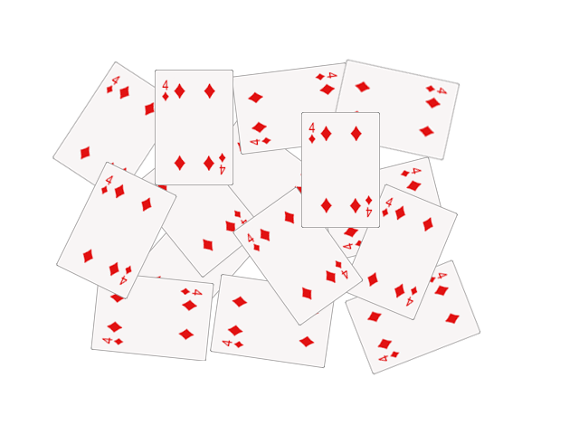

文档编写（Sphinx使用）测试
============================

文字输出
---------

这是一段测试用的简单文字：hello world!

测试小章节
~~~~~~~~~~~

这是个小章节的测试哈哈。

最小章节
^^^^^^^^

这是最小章节。

这是个链接：`Baidu <https://www.baidu.com/>`_ 

这是个列表：

* 第一
* 刀撒旦
   * hi 
* 大撒大撒

测试区块::

   测试一下

图片的输出
-----------

数学公式的输出
----------------

.. 为了提升加载速度，在conf.py中启用mathjax，并将js文件 **tex-mml-chtml.js** 放置到 **_build/html/_static** 目录下。

:math:`\sum\limits_{k=1}^\infty \frac{1}{2^k} = 1`

.. math::

   (a + b)^2  &=  (a + b)(a + b) \\
              &=  a^2 + 2ab + b^2
   
   x = {-b \pm \sqrt{b^2-4ac} \over 2a}